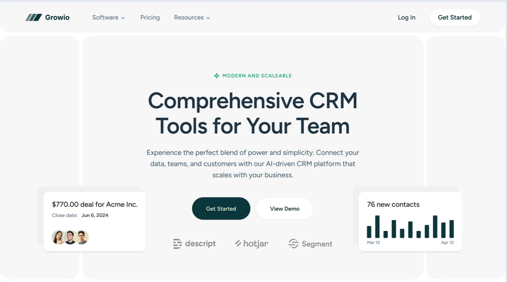
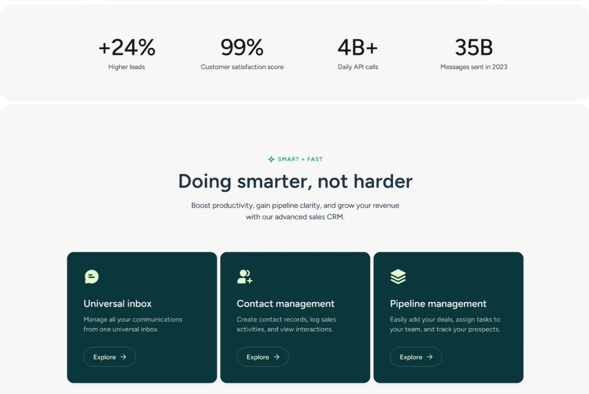
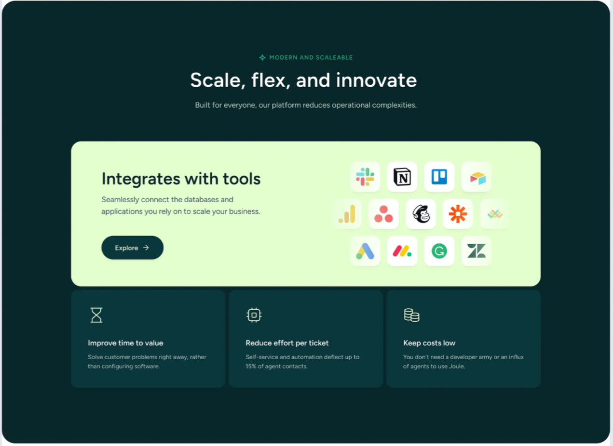
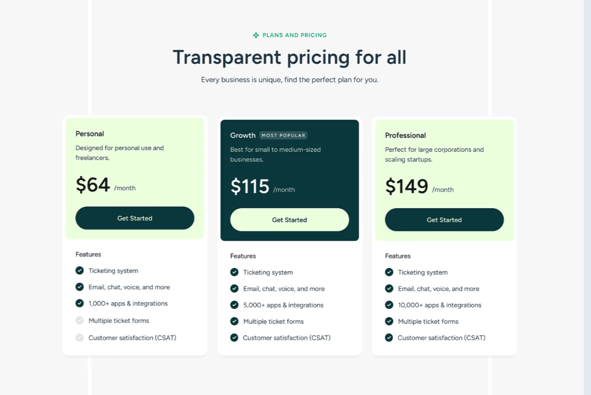
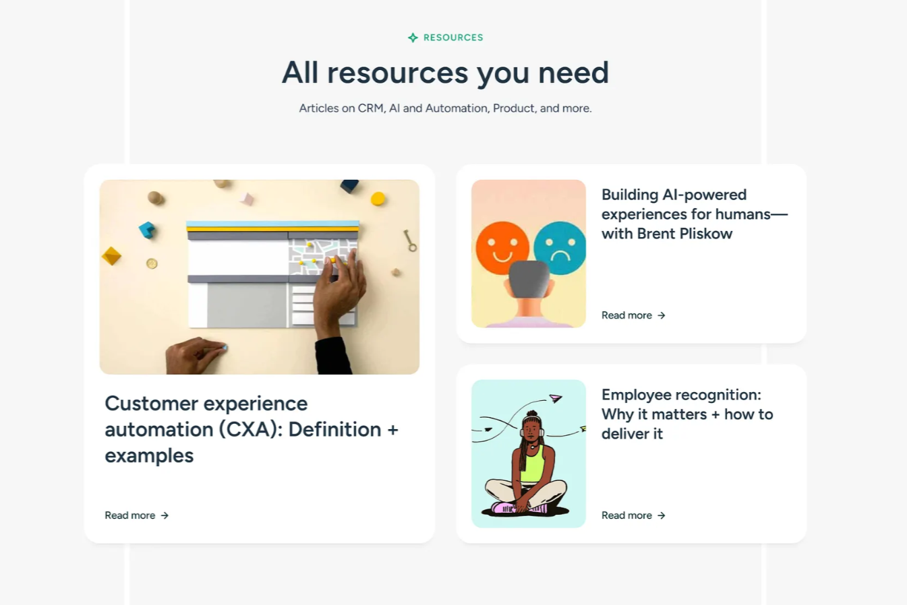
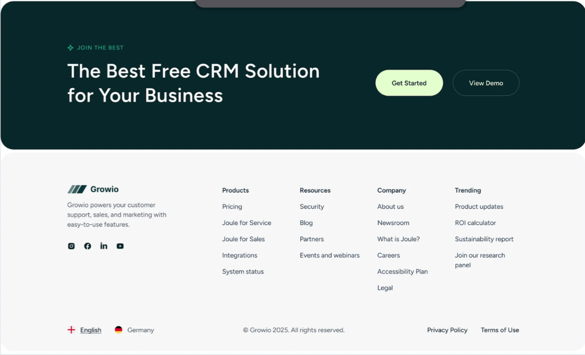

## Design Reference

This project is a frontend implementation of a design concept found on Dribbble.
Original design by [Dipa Inhouse](https://dribbble.com/shots/25472444-Growio-CRM-Landing-Page) — not created by me.

  
  
  
  
  
  

## Built With

- Next.js
- TypeScript
- Tailwind CSS

## License

The code in this repository is licensed under the [MIT License](./LICENSE).
This license applies to the code only. The visual design is based on a concept
by [Dipa Inhouse](https://dribbble.com/shots/25472444-Growio-CRM-Landing-Page) on Dribbble and is not covered by this license.
